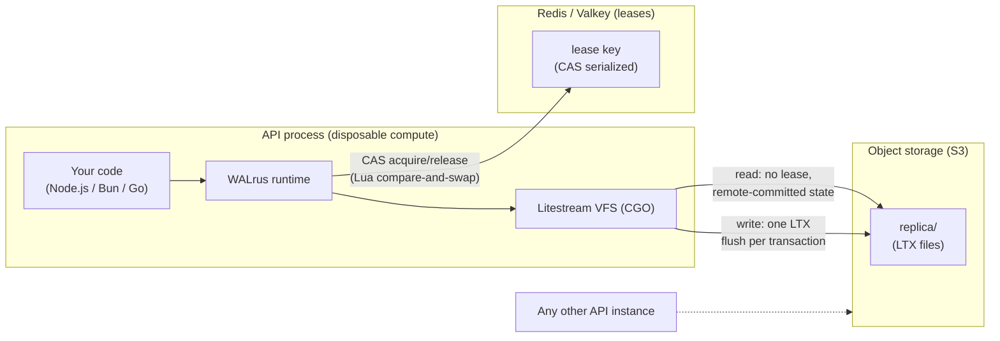
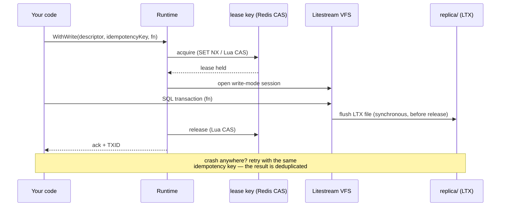

# WALrus

WALrus ("Write-Ahead Log in object storage") is a horizontally scalable,
multi-tenant SQLite runtime with one logical database per user. Cheap
object storage (Wasabi, Backblaze B2, Sliplane, or any S3-compatible store
— no conditional writes needed) is the durable database; Redis/Valkey
holds the write leases; API processes are disposable compute running an
embedded runtime.

- Any API instance can serve any request for any user — no writer fleet, no
  routing layer, no sticky sessions.
- Writes are serialized per user by a Redis/Valkey lease and
  acknowledged only after the transaction is flushed to object storage.
  Durability is confirmed by flush, never by elapsed time.
- Reads see only remote-committed state, through Litestream's VFS, with no
  local hydration.
- Go core (CGO), exposed to Node.js and Bun through one Node-API addon
  (`@walrus/db`) over a narrow C ABI.

See [docs/specs.md](docs/specs.md) for the design and invariants and
[docs/usage.md](docs/usage.md) for the full guide (Go core, `@walrus/db`,
C ABI, error model, provider conformance, configuration).

## How it fits together



Any instance can serve any request — there is no routing layer. Mutual
exclusion comes from the lease object, not from where a request lands.

### Write path

Every mutation follows the same five steps; the ack means the data is in
object storage, not just in some process's memory:



## Quick start (Bun)

Build the native pieces once:

```sh
# Go core as a shared library (requires Go with CGO)
go build -buildmode=c-shared -tags vfs -o bindings/node/lib/libwalrus.dylib ./bindings/c/lib

# Node-API addon (requires node + node-gyp)
cd bindings/node/native && npx node-gyp rebuild && cd ../../..
```

Write and read a database:

```ts
import { WALrusDatabase } from "./bindings/node/src/index";

const db = new WALrusDatabase({ owner: "my-api-instance" });

// The descriptor is issued by your control plane — never by end users.
const d = {
  database_id: "users/user_1",   // your ID; objects land at <root_prefix>/users/user_1/
  storage: { provider: "file", file_root: "/tmp/walrus-quickstart" },
  credentials: {},
};

// One write = one batch = one transaction = one lease = one confirmed flush.
await db.write({
  database: d,
  idempotencyKey: "schema",
  statements: [{ sql: "CREATE TABLE IF NOT EXISTS kv (k TEXT PRIMARY KEY, v TEXT)" }],
});

const { txid } = await db.write({
  database: d,
  idempotencyKey: "set-greeting",   // retrying this key is safe: deduplicated
  statements: [{ sql: "INSERT OR REPLACE INTO kv (k, v) VALUES ('greeting', 'hello from WALrus')" }],
});
console.log("durable at txid", txid);

// Reads see only flushed, remote-committed state.
const { rows } = await db.read({ database: d, sql: "SELECT v FROM kv WHERE k = 'greeting'" });
console.log("read:", rows[0].v);

await db.close();
```

Run it:

```sh
bun run quickstart.ts
# durable at txid 0000000000000002
# read: hello from WALrus
```

For production, swap `provider: "file"` for `"s3"` with your bucket
endpoint and org-scoped credentials, and pass `redisAddress` (plus
optional `redisPassword`/`redisDB`) so all instances share leases.
The same code runs unchanged on Node.js.
An executable conformance suite for Bun lives in
`bindings/bun/walrus.test.ts` (`bun test bindings/bun/walrus.test.ts` after
pointing `WALRUS_TEST_FILE_ROOT` at a temp dir).

## Repository layout

| Path | Contents |
| --- | --- |
| `identity/` | Canonical database IDs and object-key layout |
| `lease/` | Redis/Valkey + memory lease stores, CAS acquire/release, expiry takeover, single-flight |
| `litestream/` | Bridge to Litestream's CGO VFS: replica clients, flush barrier |
| `runtime/` | `WithRead`/`WithWrite`: lease → transaction → flush → release, idempotency |
| `walruserr/` | Classified `DB_*` error model |
| `bindings/c/` | Narrow C ABI over the core (JSON envelopes) |
| `bindings/node/` | Node-API addon + `@walrus/db` TypeScript wrapper |